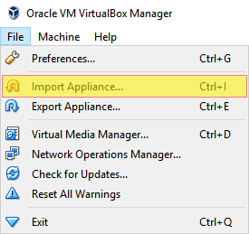
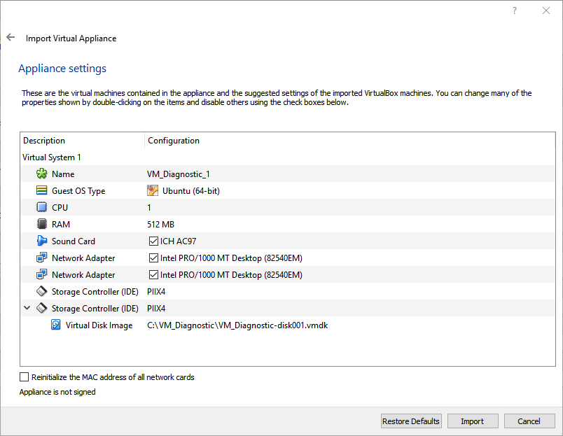
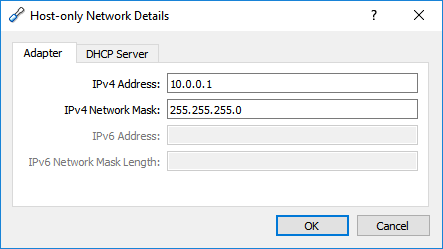
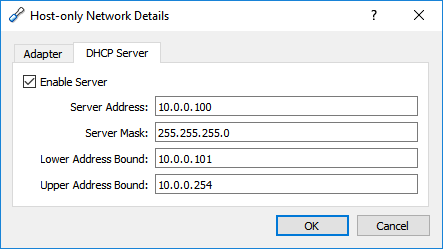
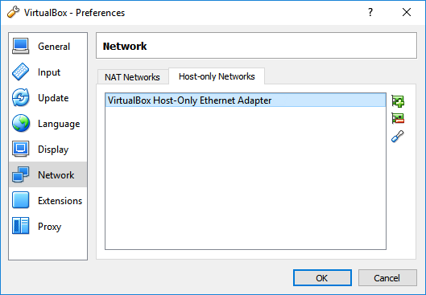
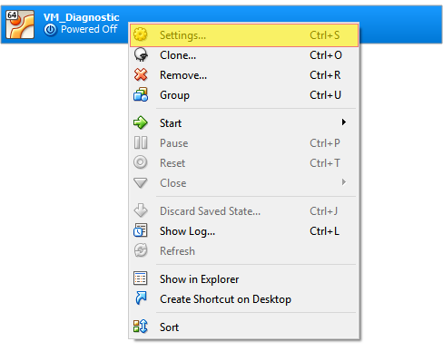
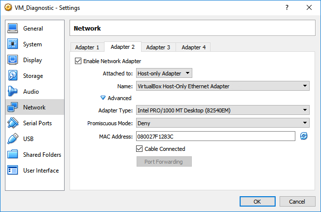
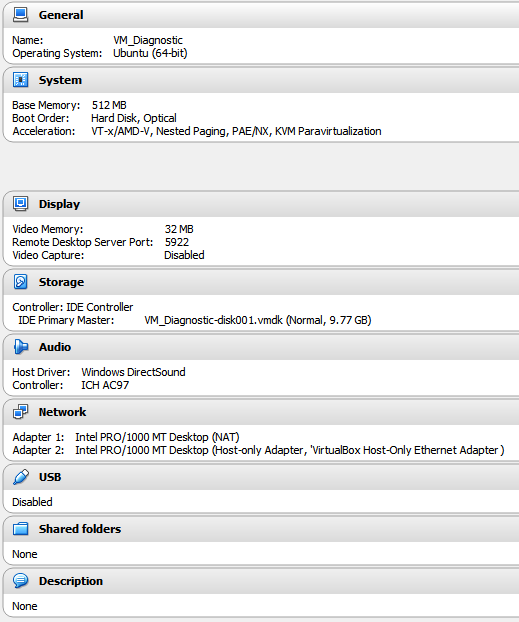
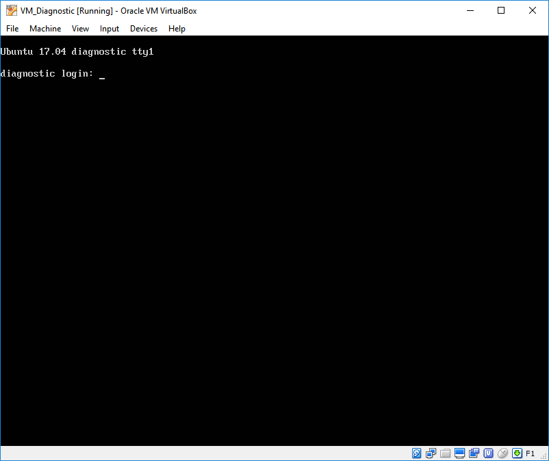

Diagnostic quick start guide
============================

Introduction
------------

Your organization processes sensitive data every day. As a manager, you
have an obligation to establish specific security procedures
(behavioral, organizational and technical) to protect this data.
Moreover, these procedures must address the fundamental principles of
necessity and proportionality. Identifying the best measures and
defining the level of effectiveness required for each measure is a
highly complex task. The CASES Diagnostic supports you in this process.

**HOW?**  
Using the dedicated questionnaire, this tool will help you :

+ Identify vulnerabilities
+ Evaluate the security level of information systems
+ Issue recommendations

### Other documents

Here would you find further Diagnostic related documentation :
* [**Technical guide**](documentation/technicalguide): Components installation walkthrough and troubleshoot section
* [**User guide**](documentation/userguide): Complete Diagnostic available functionalities documentation

Quick start
-----------

-   Download [**VM\_Diagnostic.ova**](ovaFile) ready-to-use virtual machine file which can be imported directly into a virtualization tool

-   Make use of the **installation scripts** provided in the [**Diagnostic repository**](repoLink)

### Using the Virtual Machine

The aforementioned virtual machine has already been setup and
provisioned with all application component in an Ubuntu Server 17.04
environment.

You can then import **VM\_Diagnostic.ova** file in a virtualization tool
which in our case will be VirtualBox.

#### Virtual machine import

**( File → Import Appliance )**

#### VirtualBox configuration

When successfully imported the virtual machine, you now need to setup a
Host Only Network Adapter for it in VirtualBox

**( File → Preferences → Network )**

And configure it like the following

Click OK and you should see it in the list

Then you have to tell VirtualBox that the machine you just imported have
to use the Host Only Network Adapter

Go to Network tab

And select Adapter 2 and fill like the following

Make sure everything is correctly set

And run the virtual machine. You know you are good to go when seeing
that screen:

#### Access your Diagnostic application

Open your favorite browser and type in: <http://10.0.0.101>

#### Default machine credentials

* Diagnostic application: (<diagnostic@cases.lu>:Diagnostic1!)

* Virtual machine user: (diagnostic:diagnostic)

* Mysql root user: (root:GENERATEDPASSWORD)

* Mysql diagnostic user: (diagnostic:GENERATEDPASSWORD)

### Using the installation scripts

In case you want to install the Diagnostic application on a Ubuntu or
Debian distribution you may use the provided installation scripts.

Simply run the following commands

    git clone gitrepo.git
    cd repository
    ./install.sh

Provide the script the information it needs when it asks (e.g mysql
user:password )

You are good to go after seeing that screen :

imgInstallSuccessful
